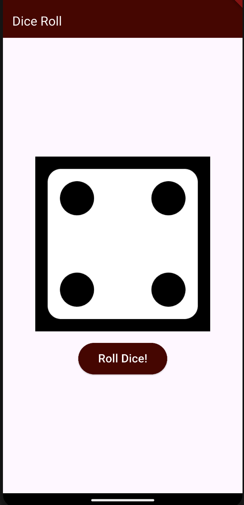

# 🎲 Dice Roller App

A simple and fun **Flutter Dice Roller app** built to practice Flutter basics like widgets, state management, and asset handling.

This app displays a dice image and changes it randomly each time the user taps the button.

---

## 📱 Features
- 🎲 Roll a dice with a button tap
- 🔁 Random dice number generation
- 🖼️ Dice images loaded using Flutter assets
- 🎨 Clean and minimal UI

---

## 🛠️ Tech Stack
- **Flutter**
- **Dart**

---

## 📂 Project Structure
dice_roller/
├── lib/
│ └── main.dart
├── assets/
│ ├── dice-1.png
│ ├── dice-2.png
│ ├── dice-3.png
│ ├── dice-4.png
│ ├── dice-5.png
│ └── dice-6.png
├── pubspec.yaml
└── README.md

---

## 🚀 Getting Started

### Prerequisites
- Flutter SDK installed
- Android Studio / VS Code
- Emulator or physical device

### Run the App
```bash
flutter pub get
flutter run

---

## 🚀 Getting Started

### Prerequisites
- Flutter SDK installed
- Android Studio / VS Code
- Emulator or physical device

### Run the App
```bash
flutter pub get
flutter run
📸 Screenshots


📚 What I Learned
Flutter widget tree
Stateless vs Stateful widgets
Using setState()
Working with assets in Flutter
Basic Git & GitHub workflow

🌱 Future Improvements
Add dice rolling animation
Improve UI design
Add sound effects

👩‍💻 Author
Bhumika Gupta
Second-year BTech IT student
Learning Flutter & app development 🚀
