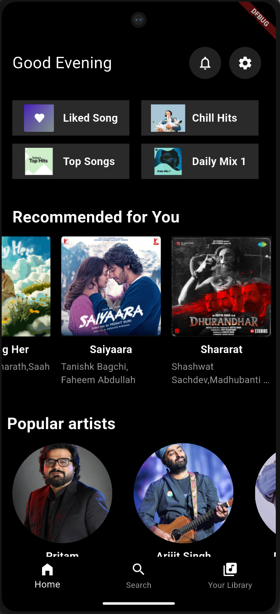

# 🎵 Spotify Home Screen Clone (Flutter)

A **Flutter UI clone** of Spotify’s home screen focusing on layout, scrolling behavior, and reusable widgets.  

---

## ✨ Features

- 🎧 Spotify-style home screen UI
- 📱 Fully responsive layout
- 🖱️ Smooth scrolling (touch + mouse support)
- 🧩 Reusable custom widgets
- 🖤 Dark theme inspired by Spotify

---

## 🧱 Widgets Used

- `SpotifyChip` – Playlist shortcut cards  
- `SpotifyAlbum` – Album/single cards  
- `SpotifyArtist` – Popular artist avatars  
- `SpotifyIcon` – Custom top-bar icons  

---

## 📂 Project Structure

```text
spotify_homescreen_clone/
 ├── lib/
 │   ├── main.dart
 │   └── widgets/
 │       ├── spotify_album.dart
 │       ├── spotify_artist.dart
 │       ├── spotify_chip.dart
 │       └── spotify_icon.dart
 ├── assets/
 │   ├── likedsong.png
 │   ├── chillhits.png
 │   ├── topsongs.png
 │   ├── dailymix1.png
 │   └── ...
 └── pubspec.yaml
```

---

## 🛠️ Tech Stack

- Flutter
- Dart
- Material UI

---

## ▶️ How to Run

```
flutter pub get
flutter run
```
Make sure a device or emulator is connected.

---

## 📸 Preview

UI inspired by Spotify (for educational purposes only).




## 🚀 Future Improvements

- Add bottom navigation functionality
- Add animations and transitions
- Integrate state management
- Add backend / API integration

---

## 👩‍💻 Author

- Bhumika Gupta
- First-year B.Tech IT student
- Flutter & UI Enthusiast 💙
